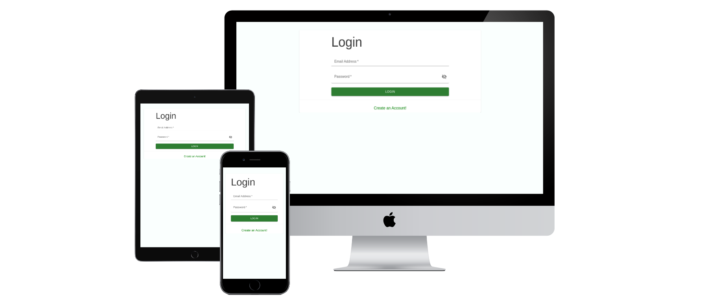

<a name="readme-top"></a>

<!--
HOW TO USE:
This is an example of how you may give instructions on setting up your project locally.

Modify this file to match your project and remove sections that don't apply.

REQUIRED SECTIONS:
- Table of Contents
- About the Project
  - Built With
  - Live Demo
- Getting Started
- Authors
- Future Features
- Contributing
- Show your support
- Acknowledgements
- License

After you're finished please remove all the comments and instructions!
-->

<div align="center">

  
  <br/>

</div>

<!-- TABLE OF CONTENTS -->

# 📗 Table of Contents

- [📖 About the Project](#about-project)
  - [🛠 Built With](#built-with)
    - [Tech Stack](#tech-stack)
    - [Key Features](#key-features)
  - [🚀 Live Demo](#live-demo)
- [💻 Getting Started](#getting-started)
  - [Setup](#setup)
  - [Prerequisites](#prerequisites)
  - [Install](#install)
  - [Usage](#usage)
  - [Run tests](#run-tests)
  - [Deployment](#deployment)
- [👥 Authors](#authors)
- [🔭 Future Features](#future-features)
- [🤝 Contributing](#contributing)
- [⭐️ Show your support](#support)
- [🙏 Acknowledgements](#acknowledgements)
- [❓ FAQ](#faq)
- [📝 License](#license)

<!-- PROJECT DESCRIPTION -->

# 📖 Coders Hub<a name="about-project"></a>

> Coders-Hub application allows user to reverse different online classes depending on their preferences. They are the assigned a mentor for each course and also get to choose how long that want to participate on the course.
<div align="center">

  
  <br/>

</div>

## 🛠 Built With <a name="built-with"></a>
- HTML
- CSS
- JS
- React
- Redux
- Rails API

### Tech Stack <a name="tech-stack"></a>

<details>
  <summary>Client</summary>
  <ul>
    <li><a href="https://www.w3schools.com/js/">JavaScript</a></li>
    <li><a href="https://www.w3schools.com/html/">HTML</a></li>
    <li><a href="https://www.w3schools.com/css/">CSS</a></li>
    <li><a href="https://www.w3schools.com/react/">React/Redux</a></li>
    <li><a href="https://www.w3schools.io/learn/rubyonrails-tutorials/">Rails</a></li>
    
  </ul>
</details>

<!-- Features -->

### Key Features <a name="key-features"></a>

> Using the project will help you to : 

- **See online classes to attend**
- **Reserve a class to attend**

<p align="right">(<a href="#readme-top">back to top</a>)</p>

<!-- LIVE DEMO -->

## 🚀 Live Demo <a name="live-demo"></a>

- [Live Demo Link](https://codershub-8u8o.onrender.com/)


<p align="right">(<a href="#readme-top">back to top</a>)</p>

<!-- GETTING STARTED -->

## 💻 Getting Started <a name="getting-started"></a>

To get a local copy up and running follow these simple example steps.

### Prerequisites

In order to run this project you need:

- Node js installed on your computer
- Npm Node package manager
- Terminal
- Code editor preferably [Vscode](https://code.visualstudio.com/).

### Setup

👉 Clone this repository by using the command line : 
- `git clone https://github.com/manq2010/Book-An-Appointment-Front-End`

👉 Clone back end repository by using the command line : 
- `git clone https://github.com/Cluab/Book-An-Appointment-Back-End`

👉 Add the `.env` file to the root folder of the current repo (Front-End)

👉 Add the following lines on the `.env` file

```js
REACT_APP_BACKEND="http://localhost:3000/api/v1"
REACT_APP_CLIENT_ID="tqiRUMtQta0eEw6lp3X9iPQK8n5ZlS7OmiKLK0eHJoI"
REACT_APP_CLIENT_SECRET="sAaKljs__17vKbKoVT8G_Jsw-dMrOP8N4i_aPBEjcLQ"
```
#### NB: Using the above details on your `.env` file will not work as each devices needs its unique `REACT_APP_CLIENT_ID` and `REACT_APP_CLIENT_SECRET` details, use the step below to generate for your device

👉 On the Back-End Repo, run the seed file by using the command line :
- `rails db:seed`

👉 Open rails console by using the command line from the Back-End repo cloned above:
- `rails c`

👉 Run the following code on the rails console :
- `Doorkeeper::Application.find_by(name: 'React')`

👉 Replace the `REACT_APP_CLIENT_ID` on the `.env` file with the id shown on the console :

`uid: "tqiRUMtQta0eEw6lp3X9iPQK8n5ZlS7OmiKLK0eHJoI"`

👉 Run the following code on the rails console :
- `Doorkeeper::Application.find_by(name: 'React').secret`

👉 Replace the `REACT_APP_CLIENT_SECRET` on the `.env` file with the id shown on the console :

`=> "sAaKljs__17vKbKoVT8G_Jsw-dMrOP8N4i_aPBEjcLQ"`

#### NB: The `.env` file should look similar to the example above once your unique id and secret key are generated 

### Install

Install this project with:

- for the front end rep

`npm install`

- for the back end repo

`bundle install --force`

### Usage

To run the project, execute the following command:

- for the back end repo

`rails s`

- for the front end rep

`npm start`

#### NB: Start the back end server first

### Login

Use the below details to `login` as admin

```js
email: admin@example.com
password: password
```

#### NB: Ensure the `rails db:seed` was run from above for the admin role to work. 

If you want to login as normal user, follow the sign-up precess.

#### NB: If you not able to sign-in, kindly refresh page and try to sign-in again

### Run tests

To run tests, run the following command:

`npm test `

### Deployment

You can deploy this project using: 

`npm run deploy`

<p align="right">(<a href="#readme-top">back to top</a>)</p>

<!-- AUTHORS -->

## 👥 Authors <a name="authors"></a>

👤 **Mancoba Sihlongonyane**

- GitHub: [@manq2010](https://github.com/manq2010/)
- Twitter: [@mancoba_c](https://twitter.com/mancoba_c/)
- LinkedIn: [mancobasihlongonyane](https://linkedin.com/in/mancobasihlongonyane/)

👤 **Ibrahim Suhail Al-Yousefi**

- GitHub: [@cluab](https://github.com/Cluab)
- Twitter: [@cluab122](https://twitter.com/cluab122)
- LinkedIn: [Ebrahim Al-Yousefi](https://www.linkedin.com/in/ebrahim-alyousefi/)
- Instagram: [@27.i.b](https://www.instagram.com/27.i.b/)

👤 **Krishna Prasad Acharya**

- GitHub: [@krishnabot](https://github.com/Krishnabot)
- Twitter: [@last_matrix](https://twitter.com/last_matrix)
- LinkedIn: [@Krishnabot](https://www.linkedin.com/in/krishnabot/)

👤 **Frehiywot Nega**

- GitHub: [@frnega](hhttps://github.com/frnega)
- Twitter: [@twitter](https://twitter.com/twitter)
- LinkedIn: [@frehiywot-nega](https://www.linkedin.com/in/frehiywot-nega/)

👤 **Idrissa makoba omar**

- GitHub: [omarbabou](https://github.com/omarbabou)
- LinkedIn: [Idrissa makoba omar](https://www.linkedin.com/in/idrissa-makoba-omar/)
- twitter: [BabouOmar3](https://twitter.com/BabouOmar3)

<p align="right">(<a href="#readme-top">back to top</a>)</p>

<!-- FUTURE FEATURES -->

## 🔭 Future Features <a name="future-features"></a>


- **Remove reservations made by user**
- **Add email confirmation to access website when creating a profile**
- **Edit online classes and reservation**

<p align="right">(<a href="#readme-top">back to top</a>)</p>

<!-- CONTRIBUTING -->

## 🤝 Contributing <a name="contributing"></a>

Contributions, issues, and feature requests are welcome!

Feel free to check the [issues page](../../issues/).

<p align="right">(<a href="#readme-top">back to top</a>)</p>

<!-- SUPPORT -->

## ⭐️ Show your support <a name="support"></a>

Give a ⭐️ if you like this project!

<p align="right">(<a href="#readme-top">back to top</a>)</p>

<!-- ACKNOWLEDGEMENTS -->

## 🙏 Acknowledgments <a name="acknowledgements"></a>

- Thank you [Microverse](https://www.microverse.org/) for the project
- Original design by [Murat Korkmaz](https://www.behance.net/muratk)

<p align="right">(<a href="#readme-top">back to top</a>)</p>

<!-- FAQ (optional) -->

## ❓ FAQ <a name="faq"></a>


- **How to use the project**

  - ```git clone https://github.com/manq2010/Book-An-Appointment-Front-End```

- **How to contribute to the project**

  - Fork it by using ``fork`` button, or you can contact me.

<p align="right">(<a href="#readme-top">back to top</a>)</p>

<!-- LICENSE -->

## 📝 License <a name="license"></a>

This project is [MIT](./LICENCE.md) licensed.

<p align="right">(<a href="#readme-top">back to top</a>)</p>
